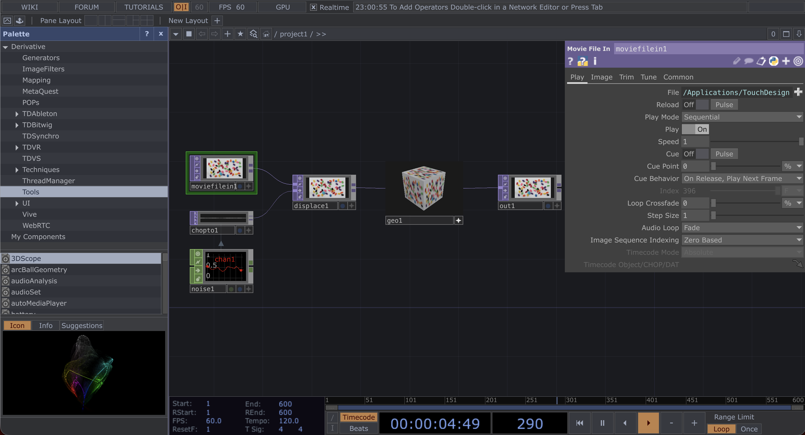
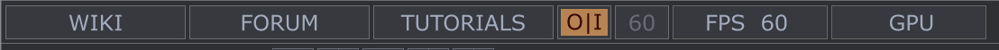
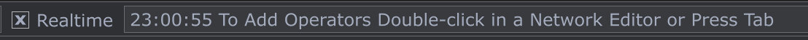
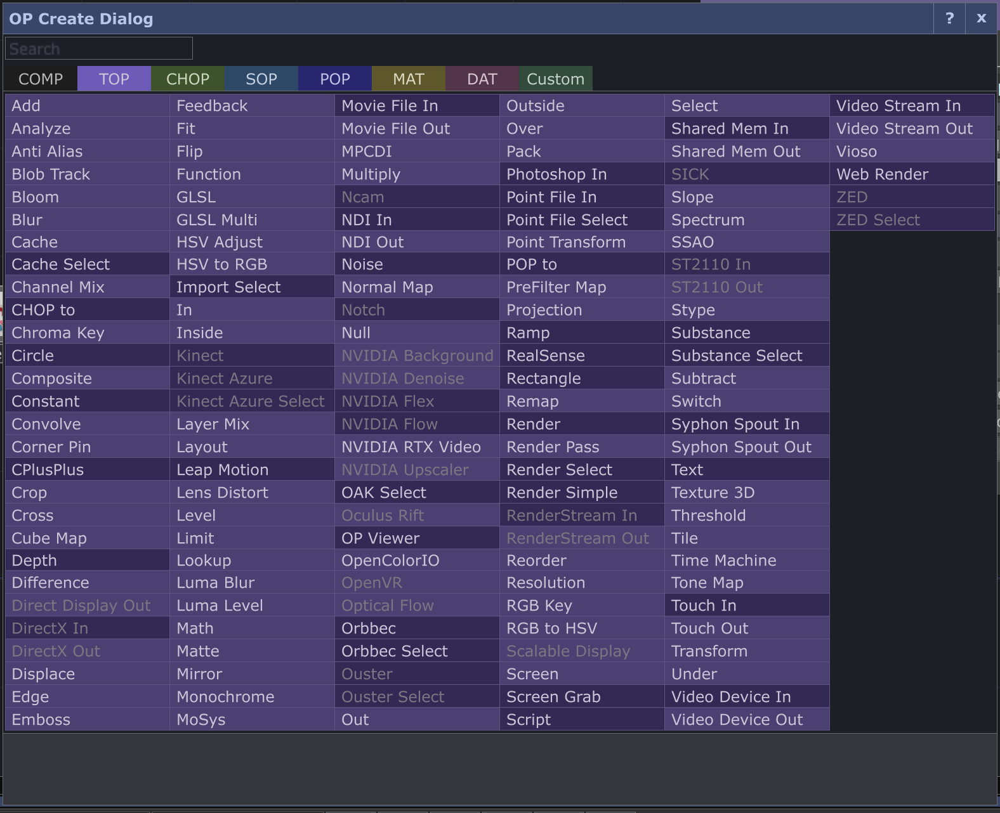

Apuntes de: Valentina Ruz

Fecha: Mar 16 jun.

---

# Apuntes sobre *Touch Designer*

`¿Qué es?`

- TouchDesigner es un lenguaje de programación a base de nodos que permite prototipar y desarrollar proyectos para contenido multimedia interactivo en tiempo real. En lugar de escribir códigos, se trata de conectar operadores entre sí para formular operaciones complejas.
- Su capacidad de operar en tiempo real lo hace ideal para performances, instalaciones artísticas y visualizaciones de datos interactivas. Fue desarrollado por Derivative, una compañía canadiense fundada por Greg Hermanovic.

Guía y tutorial: <https://derivative.ca/UserGuide/Tutorials>

## Curso para principiantes - Apuntes

[CURSO](https://www.youtube.com/watch?v=P0MfMFejaxE&list=PLCQm2_dRv60UHReSDzlzDTB2P5Y2Rk9WX)

### ¿Qué es touchdesigner?

- Es un lenguaje de programación visual basado en nodos que funciona a tiempo real:
  - Básicamente es unir cajas.
  - No se necesita tener un nivel de programación para crear cosas.
  - Cada caja o cada operador, realiza una acción específica y están separadas por categorías.
  - Cubre elementos 2d y 3d
  - Nos permite tener entradas y salidas de videos y sonidos; canales de animación, paneles de control, programación.
  - Podemos tener conexiones con web socket.
  - Touchdesigner está basado en python.

### Descargas y licencias

- Touchdesigner nos ofrece 4 tipos de licencias:
  - non-commercial
  - educational
  - commercial
  - pro
- Es una buena idea manejar la licencia en usb por si tengo que ir a otro lado, etc.

### Interfaz

- En el centro están todos los operadores, que están conectados y llamaremos *red*
- Al lado derecho, tenemos la caja de propiedades
- Al lado izquierdo, tenemos las paletas

- Arriba, en la parte superior, está el file (exportar,etc)
- Edit
- Dialogs

Tenemos otras funciones como:

- Wiki: es la wikipedia de touch
- Forum: son los foros de touch
- Tutorials: a los tutoriales de touch
- **O | I**: cooking on iof, ese botón, si lo desactivas, quiere decir que le dice a touch que no procese nada internamente. Sirve mucho para las visuales, entonces si modificó algo, presiono eso y lo vuelvo a activar.
- Frames por segundos: se modifican en la parte inferior izquierda.
- Real time: quiere decir que estamos corriendo lo que vemos a tiempo real. Lo podemos usar cuando estemos haciendo cosas muy pesadas (lo desactivas)
- La barra sale todo lo que hemos realizado.

- Perform mode: Es un modo de visualización
- Open pallete: hay opciones de componentes u operadores listas
- Layout: Tenemos como queremos trabajar en el proyecto.
  - Se pueden dividir las pantallas
- Tenemos tipos de paneles: open view, etc

Tenemos en la parte inferior:

- Nuestra línea de tiempo y su configuración
- Tenemos pausa
- Avanzar los frames con el + o -
- Le podemos decir que corra solo una vez o que sea un loop permanente

En la parte central tenemos la network, donde podemos conectar lo que queramos

- apretamos *tab* y se abre la ventana de los operadores
- `COMP:` son redes propias, tienen una red interna (ej: una camara, ya tiene toda la configuración para que sea cámara)
- `TOP:` imagenes en general
- `CHOP:` control de numeros
- `SOP:` todo lo que es 3d
- `MAP:` todo lo que es material
- `DAT:` todo lo que tenga que ver con programación, python
- `CUSTOM:` los que yo hice

### Operadores

